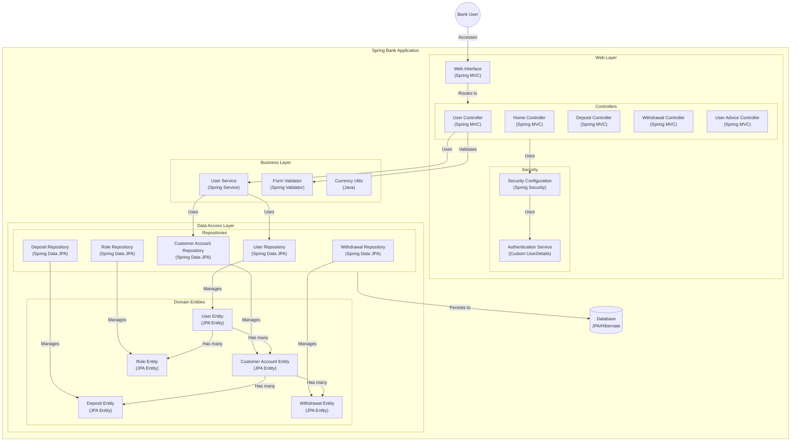

```mermaid
graph TB
    User((Bank User))
    
    subgraph "Spring Bank Application"
        subgraph "Web Layer"
            WebUI["Web Interface<br>(Spring MVC)"]
            
            subgraph "Controllers"
                UserCtrl["User Controller<br>(Spring MVC)"]
                HomeCtrl["Home Controller<br>(Spring MVC)"]
                DepositCtrl["Deposit Controller<br>(Spring MVC)"]
                WithdrawCtrl["Withdrawal Controller<br>(Spring MVC)"]
                AdviceCtrl["User Advice Controller<br>(Spring MVC)"]
            end
            
            subgraph "Security"
                SecConfig["Security Configuration<br>(Spring Security)"]
                AuthService["Authentication Service<br>(Custom UserDetails)"]
            end
        end

        subgraph "Business Layer"
            UserSvc["User Service<br>(Spring Service)"]
            FormValidator["Form Validator<br>(Spring Validator)"]
            CurrencyUtil["Currency Utils<br>(Java)"]
        end

        subgraph "Data Access Layer"
            subgraph "Repositories"
                UserRepo["User Repository<br>(Spring Data JPA)"]
                AcctRepo["Customer Account Repository<br>(Spring Data JPA)"]
                DepositRepo["Deposit Repository<br>(Spring Data JPA)"]
                WithdrawRepo["Withdrawal Repository<br>(Spring Data JPA)"]
                RoleRepo["Role Repository<br>(Spring Data JPA)"]
            end

            subgraph "Domain Entities"
                UserEntity["User Entity<br>(JPA Entity)"]
                AcctEntity["Customer Account Entity<br>(JPA Entity)"]
                DepositEntity["Deposit Entity<br>(JPA Entity)"]
                WithdrawEntity["Withdrawal Entity<br>(JPA Entity)"]
                RoleEntity["Role Entity<br>(JPA Entity)"]
            end
        end

        Database[("Database<br>JPA/Hibernate")]
    end

    %% User interactions
    User -->|"Accesses"| WebUI
    
    %% Web Layer flows
    WebUI -->|"Routes to"| Controllers
    Controllers -->|"Uses"| SecConfig
    SecConfig -->|"Uses"| AuthService
    
    %% Controller to Service flows
    UserCtrl -->|"Uses"| UserSvc
    UserCtrl -->|"Validates"| FormValidator
    
    %% Service to Repository flows
    UserSvc -->|"Uses"| UserRepo
    UserSvc -->|"Uses"| AcctRepo
    
    %% Repository to Entity flows
    UserRepo -->|"Manages"| UserEntity
    AcctRepo -->|"Manages"| AcctEntity
    DepositRepo -->|"Manages"| DepositEntity
    WithdrawRepo -->|"Manages"| WithdrawEntity
    RoleRepo -->|"Manages"| RoleEntity
    
    %% Database connections
    Repositories -->|"Persists to"| Database
    
    %% Entity relationships
    UserEntity -->|"Has many"| AcctEntity
    AcctEntity -->|"Has many"| DepositEntity
    AcctEntity -->|"Has many"| WithdrawEntity
    UserEntity -->|"Has many"| RoleEntity
```
